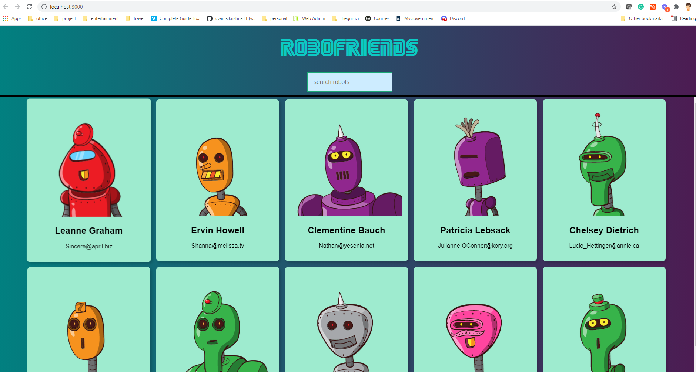
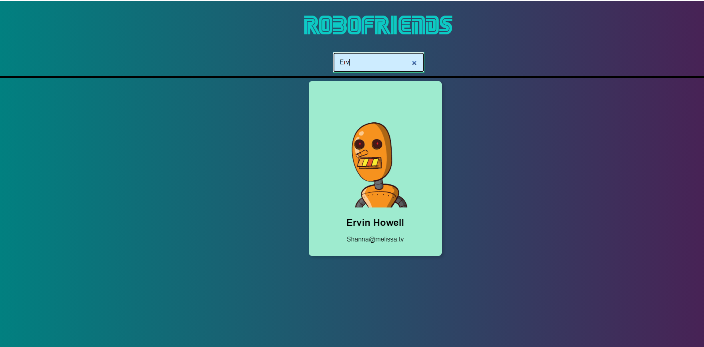
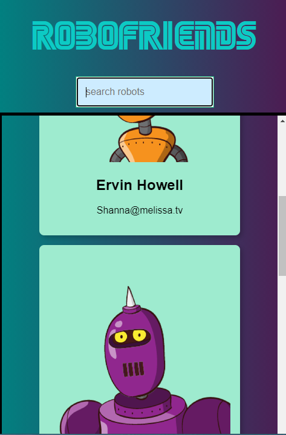

# robo-friends
Simple react app to understand
 * React components
 * state
 * props
 * scroll
 * search
 * fetch

 To run the project

 1. Clone the repo
 2. In the project directory run `npm install ` to download dependencies
 3. Run `npm start` to run the project

### Screens
<table>
  <tr>
    <td></td>
    <td></td>
    <td></td>   
  </tr>
 </table>
